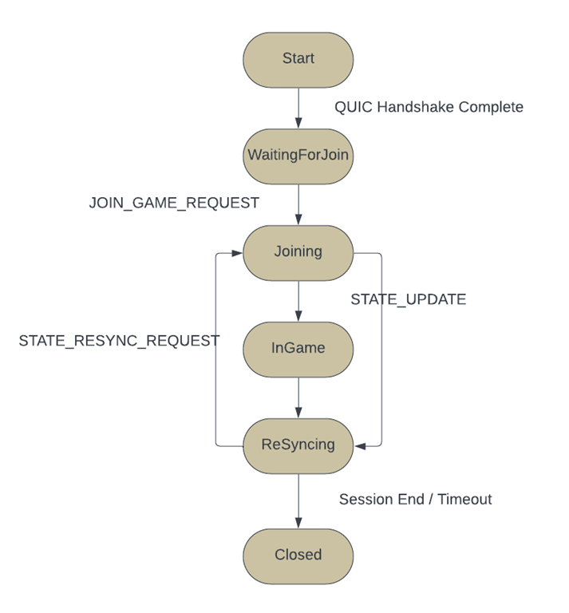

# QTGP – QUIC Turn-based Game Protocol

This project implements a reliable turn-based multiplayer game protocol (QTGP), a stateful application-layer protocol designed for turn-based multiplayer games over QUIC. QTGP provides reliable, low-latency message delivery between players and a central game server, supporting actions such as joining games and synchronizing game state. The goal of this protocol is to ensure data is transmitted quickly while maintaining a consistent and up-to-date game state across all players.

## 📁 Project Structure

```
CS544-Project/
├── main.go            # Program entry point
├── client.go          # Client-side implementation (UI + protocol)
├── server.go          # Server-side implementation (handles multiple clients)
├── state.go           # Protocol state machine and transitions
├── message.go         # Message structure definition
├── utils.go           # Helper functions for config, I/O, message framing
├── tls.go             # Self-signed TLS certificate generator
├── config.json        # JSON file to configure client (hostname)
└── go.mod             # Go module definition
```

## 🚀 Getting Started

### 1. 🛠 Installation

Clone the repository and navigate into the folder:

`git clone https://github.com/your-username/CS544-Project.git`
`cd CS544-Project`

If you do not currently have Go 1.19+ - please navigate to this link and download the version for your system:

`https://go.dev/dl/`

### 2. ⚙️ Configuration

Create a `config.json` file in the root of the project (already included in this repo). This file allows the client to know which host to connect to.

Example `config.json`:

{
  "host": "localhost"
}

## 🕹️ Running the Program

Start the program using:

`go run .`

You'll be prompted with:

`Run as server (s) or client (c)?`

### 👤 Run as Server

- Enter `s` and press Enter.
- The server will start listening on `localhost:4433`.

### 🧑‍💻 Run as Client

- Open another terminal window.
- Run `go run .` again.
- Enter `c` to start the client.
- The client will connect to the server using the hostname from `config.json` and the hardcoded port `4433`.

## 🧩 Protocol Overview

The protocol follows a state-driven interaction model. Key message types include:

- JOIN_GAME_REQUEST
- GAME_SETUP_ACK
- STATE_UPDATE
- STATE_ACK
- STATE_RESYNC_REQUEST

All communication uses JSON messages over QUIC streams. Each protocol message is sent over a new stream.

DFA Diagram:



## 📝 Notes

- The port is hardcoded to `4433` for both client and server, as per project requirements.
- The user does **not** need to know about the internal protocol — all logic is encapsulated in the client/server.
- QUIC streams are opened per message to align with stream-per-action design.

## 📧 Contact

Ashley Tulloch
CS544 - Computer Networks
ant87@drexel.edu
